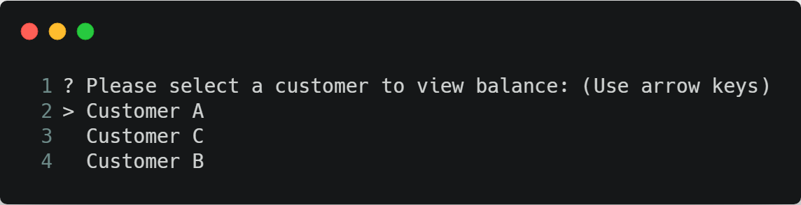
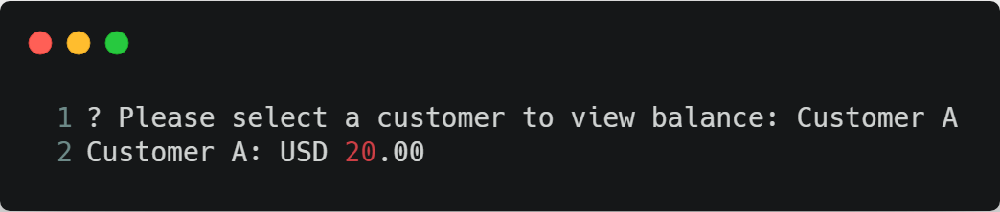

# Question #3

## 🚧 Status

- [x] Functions
- [x] Unit tests
- [x] Coverage (100%)
- [x] Document

## 📷 Screenshots





## 🚀 Getting Started

```sh
yarn start:dev
```

> Start in development mode

## 🐞 How to test

```sh
# packages/q3
yarn test
```

> Run tests
